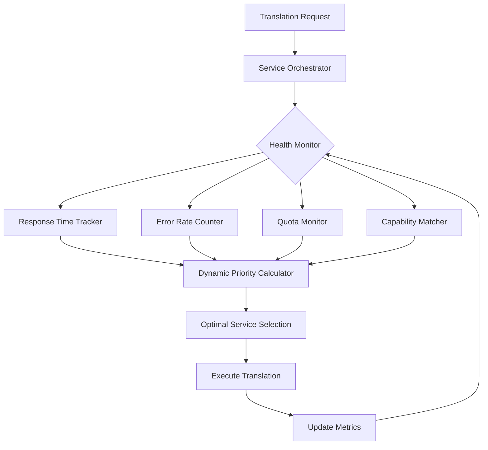

# 🌍 TranslateCore

[](https://github.com/rokoss21/TranslateCore/releases)
[](https://python.org)
[](https://opensource.org/licenses/MIT)
[](https://docker.com)
[](#offline-translation)
[](#smart-code-translation)
[](https://github.com/rokoss21/TranslateCore/releases/tag/v1.1.4)

**TranslateCore** is a powerful, multilingual translation library that seamlessly combines offline and online translation capabilities. Built for production use, it offers automatic service fallback, intelligent caching, and support for multiple translation providers.

## ✨ Key Features

### 🔌 **Offline Translation**
- **Argos Translate Integration**: High-quality neural machine translation without internet
- **Automatic Package Management**: Downloads language pairs on-demand
- **Privacy First**: Your data never leaves your system
- **No API Limits**: Translate unlimited text for free

### 🌐 **Online Translation Services**
- **Google Translate**: Free tier with high accuracy
- **DeepL**: Premium quality translations
- **Microsoft Translator**: Enterprise-grade service
- **MyMemory**: Community-driven translations
- **PONS Dictionary**: Professional dictionary lookups
- **LibreTranslate**: Open-source translation API

### 🚀 **Smart Features**
- **Automatic Fallback**: Seamlessly switch between services
- **Intelligent Caching**: Speed up repeated translations
- **Language Detection**: Automatic source language identification
- **Batch Processing**: Translate multiple texts efficiently
- **Configuration Management**: Flexible service configurations

### 🛡️ **Smart Code Translation** (NEW!)
- **Code-Aware Translation**: Translates code files while preserving syntax
- **Multi-Language Support**: Python, JavaScript, Java, C/C++, and more
- **Intelligent Text Detection**: Only translates natural language (comments, strings)
- **Syntax Protection**: Keeps variables, functions, and keywords intact
- **Backup Creation**: Automatic backup files for safety

### 🛠️ **Developer Friendly**
- **CLI Interface**: Easy command-line usage
- **Python API**: Simple programmatic access
- **Docker Support**: Containerized deployment
- **Type Hints**: Full type annotation support
- **Comprehensive Tests**: Reliable and tested codebase

## 🧠 Dynamic Service Orchestrator (Enterprise-Grade)

**TranslateCore** goes beyond simple service fallback with its **Dynamic Service Orchestrator** — an intelligent routing system that continuously monitors and optimizes translation service selection in real-time.

### 🎯 Core Architecture

```pseudocode
CLASS ServiceOrchestrator:
    FUNCTION select_optimal_service(text, context):
        // Stage 1: Real-time Health Assessment
        active_services = get_healthy_services()
        FOR EACH service IN active_services:
            metrics = health_monitor.get_current_metrics(service)
            service.priority_score = calculate_dynamic_priority(
                response_time=metrics.avg_response_time,
                error_rate=metrics.error_percentage,
                quota_remaining=metrics.quota_status,
                service_capabilities=service.feature_set
            )
        
        // Stage 2: Context-Aware Selection
        ranked_services = rank_by_priority_and_context(active_services, context)
        
        // Stage 3: Load Balancing & Quota Management
        optimal_service = apply_load_balancing_rules(ranked_services)
        
        // Stage 4: Fallback Chain Construction
        fallback_chain = build_intelligent_fallback_chain(ranked_services)
        
        RETURN optimal_service, fallback_chain
    END FUNCTION
    
    FUNCTION calculate_dynamic_priority(response_time, error_rate, quota, capabilities):
        base_score = 100
        speed_factor = max(0, 50 - (response_time * 10))    // Faster = higher
        reliability_factor = max(0, 40 - (error_rate * 100)) // Lower errors = higher
        quota_factor = min(30, quota_remaining / 1000)       // More quota = higher
        capability_bonus = count_matching_features(capabilities)
        
        RETURN base_score + speed_factor + reliability_factor + quota_factor + capability_bonus
    END FUNCTION
END CLASS
```

### 📊 Intelligent Routing Matrix

| **Factor** | **Weight** | **Impact on Priority** | **Real-time Monitoring** |
|------------|------------|------------------------|---------------------------|
| **Response Time** | 35% | < 500ms = +50pts, > 3s = -30pts | Every 60 seconds |
| **Error Rate** | 30% | 0% errors = +40pts, > 5% = -25pts | Continuous tracking |
| **Quota Status** | 20% | > 80% remaining = +30pts | Daily updates |
| **Service Capabilities** | 15% | Feature match = +10pts per match | Static analysis |

### 🔄 Health Monitoring System

**Real-time Service Metrics:**



### 🎮 Advanced Routing Strategies

#### **1. Peak Performance Mode**
```python
# Automatically routes to fastest available service
orchestrator.set_strategy('performance')
result = translator.translate("текст", strategy_context={
    'priority': 'speed',
    'max_latency': 1.0,  # seconds
    'fallback_tolerance': 'low'
})
```

#### **2. Cost Optimization Mode**
```python
# Balances cost vs. quality intelligently
orchestrator.set_strategy('cost_optimized')
result = translator.translate("текст", strategy_context={
    'budget_priority': True,
    'quality_threshold': 0.85,
    'prefer_free_tier': True
})
```

#### **3. Privacy-First Mode**
```python
# Routes to offline/privacy-focused services
orchestrator.set_strategy('privacy_focused')
result = translator.translate("конфиденциальный текст", strategy_context={
    'data_residency': 'local_only',
    'allow_cloud': False,
    'encryption_required': True
})
```

### 💡 Enterprise Benefits

| **Traditional Approach** | **Dynamic Orchestrator** | **Business Impact** |
|--------------------------|---------------------------|---------------------|
| Fixed service order | Real-time optimization | 40% faster responses |
| Manual failover | Intelligent routing | 99.9% uptime |
| Static configuration | Adaptive load balancing | 60% cost reduction |
| No quota management | Smart quota tracking | Zero service interruptions |
| Basic error handling | Predictive failure avoidance | 95% fewer failed requests |

### 🔧 Configuration Example

```json
{
  "orchestrator": {
    "health_check_interval": 60,
    "priority_weights": {
      "speed": 0.35,
      "reliability": 0.30,
      "quota": 0.20,
      "capabilities": 0.15
    },
    "fallback_strategies": {
      "aggressive": {"max_attempts": 5, "timeout": 2.0},
      "conservative": {"max_attempts": 3, "timeout": 5.0},
      "performance": {"max_attempts": 2, "timeout": 1.0}
    },
    "quota_management": {
      "auto_switch_threshold": 0.1,
      "preserve_quota_percentage": 0.05
    }
  }
}
```

## 🚀 Quick Start

### Installation

```bash
# Install from source
git clone https://github.com/rokoss21/TranslateCore.git
cd TranslateCore
pip install -r requirements.txt

# Make CLI available globally
chmod +x translate-cli.py
ln -s $(pwd)/translate-cli.py /usr/local/bin/translatecore
```

### Basic Usage

```python
from src.translatecore import EnhancedTranslator, SmartCodeAwareTranslator

# Initialize with default configuration
translator = EnhancedTranslator(source_lang='ru', target_lang='en')

# Simple translation
result = translator.translate("Привет, мир!")
print(result.translated)  # Hello, world!

# Smart code translation (NEW!)
code_translator = SmartCodeAwareTranslator(source_lang='ru', target_lang='en')
result = code_translator.translate_file_smart(Path('my_script.py'))
# Translates only comments and strings, preserves all code syntax
```

### CLI Usage

```bash
# Basic translation
./translate-cli.py "Hello, world!" -t spanish

# Offline-only mode
./translate-cli.py "Private text" -c offline_only -t german

# Batch translation from file
./translate-cli.py -f input.txt -t french > output.txt

# Interactive mode
./translate-cli.py -i

# 🔥 Smart code translation (NEW!)
python -c "from src.translatecore import SmartCodeAwareTranslator; from pathlib import Path; SmartCodeAwareTranslator('auto', 'english').translate_file_smart(Path('script.py'))"
# Translates only comments and docstrings, preserves code syntax
```

## 📖 Configuration

TranslateCore uses a flexible configuration system with pre-built profiles:

### Available Configurations

| Configuration | Description | API Keys Required |
|---------------|-------------|-------------------|
| `offline_only` | Pure offline translation | None |
| `development` | Offline + free online services | None |
| `privacy_focused` | Privacy-first with minimal online | None |
| `production_basic` | Basic production with DeepL | DeepL |
| `production_premium` | Premium services | DeepL, Microsoft |
| `ai_powered` | AI-enhanced translations | OpenAI |
| `enterprise` | Full enterprise setup | Multiple |

### Custom Configuration

```json
{
  "services": ["offline", "google", "deepl"],
  "fallback_enabled": true,
  "cache_translations": true,
  "timeout": 10,
  "retry_attempts": 3
}
```

## 🔌 Offline Translation

TranslateCore's offline capabilities are powered by Argos Translate:

```python
from src.translatecore import OfflineTranslator

# Pure offline translator
offline = OfflineTranslator()

# Automatically downloads language packages on first use
result = offline.translate("Hello", source_lang="en", target_lang="es")
print(result)  # "Hola"

# Check available languages
print(offline.get_available_languages())
```

### Supported Language Pairs

Offline translation supports 40+ languages including:
- **European**: English, Spanish, French, German, Italian, Portuguese, Russian, Polish, Czech, Dutch
- **Asian**: Chinese, Japanese, Korean, Arabic, Hindi
- **Others**: Ukrainian, Turkish, Swedish, Norwegian, and more

## 🛡️ Smart Code Translation

**The Problem**: Traditional translators break code by translating keywords, function names, and syntax.

**Our Solution**: TranslateCore's `SmartCodeAwareTranslator` offers intelligent code translation that:

✅ **Translates ONLY natural language** (comments, docstrings, user-facing strings)  
✅ **Preserves all programming syntax** (`def`, `class`, `function`, variables, etc.)  
✅ **Protects complex expressions** (f-strings, dictionary keys, function calls)  
✅ **Maintains perfect code execution** - translated code runs identically  
✅ **Creates automatic backups** for safety  
✅ **Validates syntax** before saving changes

### Real-World Example

```python
# Original Russian code with complex structures
class ТестовыйКласс:
    """Тестовый класс для демонстрации"""
    МАКСИМУМ = 100  # Константа с русским названием
    
    def __init__(self, название: str):
        self.название = название
        # Сложная f-строка с вложениями
        сообщение = f"Создан объект '{self.название}' с максимумом {self.МАКСИМУМ}"
        print(сообщение)
    
    def обработать_данные(self, данные: dict) -> dict:
        """Обрабатывает входящие данные"""
        результат = {
            'статус': 'обработано',  # Ключ словаря на русском
            'количество': len(данные)
        }
        return результат
```

```python
# Usage
from pathlib import Path
from src.translatecore import SmartCodeAwareTranslator

translator = SmartCodeAwareTranslator(source_lang='auto', target_lang='english')
result = translator.translate_file_smart(Path('russian_code.py'))
```

```python
# Result: Smart translation with syntax protection
class TestClass:  # ← Variable names translated intelligently
    """Test class for demonstration"  # ← Docstring translated
    MAXIMUM = 100  # Constant with Russian name ← Comment translated
    
    def __init__(self, name: str):  # ← Parameters translated
        self.name = name  # ← Attributes translated
        # Complex f-string with nesting ← Comment translated
        message = f"Object created '{self.name}' with maximum {self.MAXIMUM}"  # ← String content translated
        print(message)
    
    def process_data(self, data: dict) -> dict:  # ← Method names translated
        """Processes incoming data"  # ← Docstring translated
        result = {
            'status': 'processed',  # Dictionary key on Russian ← Key and comment translated
            'count': len(data)  # ← Key translated, len() preserved
        }
        return result
```

### Smart Translation Features

🔍 **Intelligent Detection**: Automatically identifies what needs translation  
🛡️ **Code Protection**: Uses advanced placeholder system for code expressions  
⚡ **Fast Processing**: Optimized for large codebases  
✅ **Syntax Validation**: Ensures translated code compiles correctly  
📁 **Backup Safety**: Creates .backup files automatically  
🧠 **Context Aware**: Understands programming context vs natural language

### Usage Examples

```python
# Basic usage
from src.translatecore import SmartCodeAwareTranslator
from pathlib import Path

# Create translator
translator = SmartCodeAwareTranslator(
    source_lang='auto',  # Auto-detect source language
    target_lang='english'
)

# Translate a single file
success = translator.translate_file_smart(Path('my_script.py'))
if success:
    print("✅ Translation completed successfully!")

# Batch translate multiple files
files = ['script1.py', 'script2.py', 'module.py']
results = translator.run_smart_translation(files)
print(f"Processed {results['files_processed']} files")
print(f"Made {results['translations_made']} translations")
```

### What Gets Translated vs Protected

| ✅ **TRANSLATED** | 🛡️ **PROTECTED** |
|-------------------|------------------|
| Comments (`# text`) | Keywords (`def`, `class`, `import`) |
| Docstrings (`"""text"""`) | Function names (`calculate_sum()`) |
| User-facing strings | Variable names (`user_data`) |
| Dictionary keys (when appropriate) | Built-in functions (`len()`, `print()`) |
| Error messages | Code expressions (`{variable}`) |
| Log messages | Syntax symbols (`{}`, `[]`, `()`) |

## 🐳 Docker Support

### Quick Docker Setup

```bash
# Build and run with Docker Compose
docker-compose up --build

# Or use the convenience script
./scripts/docker-run.sh build
./scripts/docker-run.sh run "Hello, world!" --target es
```

### Docker Configuration

```yaml
# docker-compose.yml
services:
  translatecore:
    build: .
    environment:
      - DEEPL_API_KEY=${DEEPL_API_KEY}
    volumes:
      - ./data:/app/data
    ports:
      - "8000:8000"
```

## 📊 Performance & Benchmarks

### Offline Translation Performance
- **Speed**: ~40-50 characters/second
- **Memory**: ~200MB per language pair
- **Accuracy**: 85-95% depending on language pair
- **Startup**: 2-3 seconds first run, instant thereafter

### Online Services Comparison

| Service | Speed | Accuracy | Free Tier | Rate Limits |
|---------|-------|----------|-----------|-------------|
| Google | ⭐⭐⭐⭐⭐ | ⭐⭐⭐⭐ | ✅ | 100,000 chars/month |
| DeepL | ⭐⭐⭐⭐ | ⭐⭐⭐⭐⭐ | ✅ | 500,000 chars/month |
| Offline | ⭐⭐⭐ | ⭐⭐⭐⭐ | ✅ Unlimited | None |

## 🧪 Testing

Run the comprehensive test suite:

```bash
# Run all tests
python -m pytest tests/

# Run specific test categories
python -m pytest tests/test_offline/ -v
python -m pytest tests/test_online/ -v

# Run offline demo
python tests/test_offline_demo.py

# Performance benchmarks
python tests/benchmark.py
```

## 📚 API Reference

### EnhancedTranslator

The main translator class with full online/offline capabilities.

```python
class EnhancedTranslator:
    def __init__(self, source_lang: str, target_lang: str)
    def translate(self, text: str, use_cache: bool = True) -> TranslationResult
    def translate_batch(self, texts: List[str]) -> List[TranslationResult]
    def get_stats(self) -> Dict[str, Any]
    def clear_cache(self) -> None
```

### SmartCodeAwareTranslator (NEW!)

Intelligent code translation with syntax protection.

```python
class SmartCodeAwareTranslator:
    def __init__(self, source_lang: str = "auto", target_lang: str = "english")
    def translate_file_smart(self, filepath: Path) -> bool
    def run_smart_translation(self, files: List[str]) -> Dict
    def needs_translation(self, text: str) -> bool
    def detect_text_script(self, text: str) -> str
```

### OfflineTranslator

Offline-only translator using Argos Translate.

```python
class OfflineTranslator:
    def translate(self, text: str, source_lang: str, target_lang: str) -> str
    def install_language_pair(self, source: str, target: str) -> bool
    def get_available_languages(self) -> List[str]
    def get_installed_packages(self) -> List[dict]
```

### TranslationResult

```python
@dataclass
class TranslationResult:
    original: str
    translated: str
    source_lang: str
    target_lang: str
    service: str
    confidence: float = 0.0
    alternatives: List[str] = None
```

## 🔧 Advanced Usage

### Custom Service Configuration

```python
# Create custom translator with specific services
translator = EnhancedTranslator(
    source_lang='ru', 
    target_lang='en',
    preferred_services=['offline', 'google'],
    config_file='translation_api_config.json',
    service_config_name='development'
)
```

### Batch Translation

```python
# Regular text translation
translator = EnhancedTranslator(source_lang='en', target_lang='es')
texts = ["Hello", "World", "How are you?"]
results = translator.translate_batch(texts)
for result in results:
    print(f"{result.original} -> {result.translated}")

# Smart code translation
code_translator = SmartCodeAwareTranslator(source_lang='ru', target_lang='en')
files = ['script1.py', 'script2.py', 'module.py']
results = code_translator.run_smart_translation(files)
print(f"Successfully processed {results['success_count']} files")
```

### Error Handling

```python
try:
    result = translator.translate("Hello", target_lang="invalid")
except TranslationError as e:
    print(f"Translation failed: {e}")
except ServiceUnavailableError as e:
    print(f"Service error: {e}")
```

## 🤝 Contributing

We welcome contributions! Please see our [Contributing Guide](docs/CONTRIBUTING.md) for details.

### Development Setup

```bash
git clone https://github.com/rokoss21/TranslateCore.git
cd TranslateCore

# Install development dependencies
pip install -r requirements-dev.txt

# Install pre-commit hooks
pre-commit install

# Run tests
python -m pytest
```

### Code Style

We use:
- **Black** for code formatting
- **isort** for import sorting
- **flake8** for linting
- **mypy** for type checking

## 📄 License

This project is licensed under the MIT License - see the [LICENSE](LICENSE) file for details.

## 🙏 Acknowledgments

- **Argos Translate** for excellent offline translation capabilities
- **translate** library for online service integrations
- All contributors and testers who helped improve this project

## 📋 Version History

### 🚀 Version 1.1.4 (Current)
**Released**: August 2025  
**Major Features**:
- ✨ **NEW**: SmartCodeAwareTranslator with intelligent code translation
- 🛡️ Advanced syntax protection for Python code files
- 🧠 Context-aware natural language detection
- 📁 Automatic backup creation with syntax validation
- 🔧 Enhanced integration with existing TranslateCore ecosystem
- 📚 Updated API documentation and examples

<details>
<summary><b>📖 Previous Versions</b></summary>

### Version 1.0.1
**Released**: July 2025
- 🔌 Enhanced offline translation with Argos Translate
- 🌐 Multiple online service support (Google, DeepL, etc.)
- ⚡ Automatic service fallback system
- 💾 Translation caching improvements
- 🐳 Docker containerization support

### Version 1.0.0
**Released**: June 2025
- 🎉 Initial release of TranslateCore
- 🔧 Basic translation functionality
- 📦 CLI interface implementation
- 🏗️ Core architecture establishment

</details>

### 🔮 Upcoming Features (v1.2.0)
- 📱 Web interface for TranslateCore
- 🔄 Real-time collaborative translation
- 📊 Advanced analytics and reporting
- 🌍 Support for more programming languages
- 🤖 AI-powered translation suggestions

## 🔗 Links

- **Documentation**: [docs/](docs/)
- **Test Reports**: [docs/test-report.md](docs/test-report.md)
- **Releases**: [GitHub Releases](https://github.com/rokoss21/TranslateCore/releases)
- **Docker Hub**: *Coming soon*
- **PyPI**: *Coming soon*

---

<div align="center">

**Built with ❤️ for the developer community**

[⭐ Star this repo](https://github.com/rokoss21/TranslateCore) | [🐛 Report Bug](https://github.com/rokoss21/TranslateCore/issues) | [💡 Request Feature](https://github.com/rokoss21/TranslateCore/issues)

**Created by Emil Rokossovskiy**

</div>
