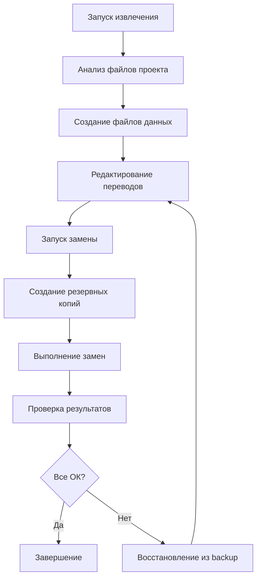

# 🚀 Начало работы с TranslateCore

Добро пожаловать в TranslateCore! Этот гид поможет вам быстро начать работу с системой.

## 📁 Структура проекта

```
TranslateCore/
├── 📜 config.py                    # Конфигурации языков и проектов
├── 🔧 universal_extract.py         # Универсальный извлекатель текста
├── 🔄 universal_replace.py         # Универсальный заменитель текста
├── ⚡ translate_quick.py           # Быстрый запуск (интерактивный)
├── 📊 extract_russian_text.py      # Оригинальная версия для русского
├── 🔁 replace_russian_text.py      # Оригинальная версия для русского
├── 🧪 test_replacement.py          # Тестовый скрипт
├── 📖 README.md                    # Основная документация
├── 📋 TRANSLATION_README.md        # Подробное руководство
├── ⚡ QUICK_TRANSLATION_GUIDE.md   # Краткое руководство
└── 📝 GETTING_STARTED.md           # Этот файл
```

## 🎯 Выберите свой сценарий

### 🔥 Быстрый старт (интерактивный)
```bash
python3 translate_quick.py
```
Запустите интерактивное меню с пошаговыми инструкциями.

### ⚙️ Python проект с русским языком
```bash
# 1. Извлечение
python3 universal_extract.py --preset python_project --language russian

# 2. Отредактируйте russian_text_simple.txt

# 3. Замена
python3 universal_replace.py --language russian
```

### 🌐 Веб-проект с китайским языком
```bash
# 1. Извлечение
python3 universal_extract.py --preset web_project --language chinese --project /path/to/web/app

# 2. Отредактируйте chinese_text_simple.txt

# 3. Замена
python3 universal_replace.py --language chinese --project /path/to/web/app
```

### ☕ Java проект с японским языком
```bash
# 1. Извлечение
python3 universal_extract.py --preset java_project --language japanese --project /path/to/java/project

# 2. Отредактируйте japanese_text_simple.txt

# 3. Замена
python3 universal_replace.py --language japanese --project /path/to/java/project
```

### 🛠️ Пользовательская конфигурация
```bash
# Извлечение корейского текста из документации
python3 universal_extract.py \
    --language korean \
    --files "*.md" "*.rst" "*.txt" \
    --dirs docs documentation \
    --project /path/to/docs
```

## 📚 Поддерживаемые языки

| Код | Язык | Описание |
|-----|------|----------|
| `russian` | 🇷🇺 Русский | Кириллица (русский, украинский, белорусский) |
| `chinese` | 🇨🇳 中文 | Китайские иероглифы |
| `japanese` | 🇯🇵 日本語 | Хирагана, катакана, кандзи |
| `korean` | 🇰🇷 한국어 | Хангыль |
| `arabic` | 🇸🇦 العربية | Арабские символы |
| `hebrew` | 🇮🇱 עברית | Иврит |
| `thai` | 🇹🇭 ไทย | Тайские символы |
| `greek` | 🇬🇷 Ελληνικά | Греческие символы |

```bash
# Посмотреть все языки
python3 universal_extract.py --list-languages
```

## 🏗️ Предустановленные конфигурации

| Имя | Языки файлов | Целевой язык | Описание |
|-----|-------------|--------------|----------|
| `python_project` | `*.py` | `russian` | Python проекты |
| `web_project` | `*.js`, `*.jsx`, `*.ts`, `*.tsx`, `*.html` | `chinese` | Веб-приложения |
| `java_project` | `*.java` | `japanese` | Java приложения |
| `documentation` | `*.md`, `*.rst`, `*.txt` | `russian` | Документация |

```bash
# Посмотреть все предустановки
python3 universal_extract.py --list-presets
```

## 💡 Полезные советы

### ✅ Первый запуск
1. **Начните с тестового проекта** - не запускайте сразу на большом проекте
2. **Используйте предустановки** - они настроены оптимально
3. **Проверяйте резервные копии** - они создаются автоматически

### 📝 Заполнение переводов
1. **Открывайте в текстовом редакторе** с поддержкой UTF-8
2. **Не меняйте структуру** - только добавляйте переводы после `|`
3. **Сохраняйте форматирование** - пробелы и переводы строк важны

### 🔍 Отладка
```bash
# Извлечение только из одной директории
python3 universal_extract.py --dirs src --files "*.py"

# Предварительный просмотр замен
python3 universal_replace.py --dry-run

# Принудительная замена без подтверждения
python3 universal_replace.py --force
```

## ⚠️ Частые проблемы

### Проблема: "Файлы не найдены"
**Решение:** Проверьте путь к проекту и паттерны файлов
```bash
python3 universal_extract.py --project /correct/path --files "*.py"
```

### Проблема: "Текст не извлекается"
**Решение:** Убедитесь, что язык настроен правильно
```bash
python3 universal_extract.py --list-languages
python3 universal_extract.py --language chinese  # для китайского
```

### Проблема: "Замена не работает"
**Решение:** Проверьте файлы переводов
```bash
# Убедитесь, что файл существует и содержит переводы
ls -la *_text_simple.txt
head -10 russian_text_simple.txt
```

### Проблема: "Повреждение кода"
**Решение:** Восстановите из резервной копии
```bash
cp backup_before_translation_russian/* /original/path/
```

## 📈 Рабочий процесс



## 🚀 Готовы начать?

1. **Выберите ваш сценарий** из списка выше
2. **Запустите команды** в указанном порядке  
3. **Проверьте результаты** и наслаждайтесь переведенным кодом!

---

**Нужна помощь?** 
- 📖 Читайте [README.md](README.md) для подробной информации
- 📋 См. [TRANSLATION_README.md](TRANSLATION_README.md) для детального руководства
- ⚡ Используйте [QUICK_TRANSLATION_GUIDE.md](QUICK_TRANSLATION_GUIDE.md) для краткой справки
